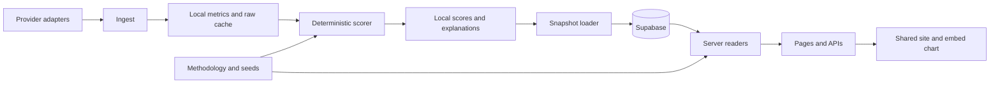

# Prove-It Clock — Implementation

**Status:** 2026-09-22. v0.2.0 is active. Scope before further implementation. Muse is the existing build teammate; Codex owns backend architecture, schemas, ingestion, and API contracts. Alex approves methodology changes. A snapshot loader merged during this review; Part 2 includes its remaining gaps.

**How this doc works:** Part 1 is non-technical — what the product is, how it works, the ranking factors, the strategy. Part 2 is the technical build plan. If you don't code, read Part 1.

**Non-goals:** no scoring-logic changes without a methodology version bump. No speculation. No price prediction. Algorithms calculate; AI explains; humans version methodology.

---

# Part 1 — The design (non-technical)

## What this is

One question: *is a crypto project actually becoming what it promised to become?*

The value: estimate whether a project is full of it or not, based on ranking factors, displayed as a historical timeline where each factor can be inspected for accountability.  As clock runs out it's a very good indicator token should be viewed as a shitcoin and marketcap reflected accordingly.

What it is not: investment advice, price prediction, or a hype amplifier.

## The game design

The core loop:

1. A project makes promises (thesis, roadmap, milestones).
2. Time passes — the Clock keeps the timeline.
3. The Clock checks: what was kept, how fast, how recently.
4. The verdict renders as a timeline. The longer the timeline, the harder to fake.

Every factor behind the verdict is inspectable — accountability means you can see the work. A project's win condition: keep promises, keep them recently, keep them coming.

## Two-track architecture

**Planned Track 1 — Promise. This is the rank.** Four factors: how long they've been promising, how many promises they kept, how fast they keep them, when they last kept one. One number, pure accountability, the main line on the chart. The proposed homepage will sort by this; the current table defaults to Reality.

**Track 2 — Context. This is the qualifier.** Everything else: potential, realism, competition, token distribution, utility, company structure, dev activity. Second line on the chart. It qualifies the rank but never overrides it.

The anti-hype rule: no amount of good context rescues a bad promise record. A project can't hide a 12-year staleness behind "active GitHub" or "real utility."

## Ranking factors

Promise-track inputs are defined in seeds and the factor inventory. Promises kept is displayed; duration has a DB mapping defect; rate/recency are not separately displayed:
- **Promise duration** — how long have they been promising?
- **Promises kept** — how many milestones did they actually deliver, historically dated?
- **Promise rate** — kept ÷ years. How fast do they deliver? Read next to recency — coarse milestones saturate, so it punishes longevity alone.
- **Promise recency** — when did they last keep a promise? The flagship story in one number (see Realism versus potential).

Context track (the qualifier):
- **Overall potential** — how big could this be if delivered? Subjective, needs more thought. World-impact score used for now.
- **Realism** — how likely is the remaining promise, given the time gone and who's eating the lane? The fairness lens on staleness (details below). Needs thought before it becomes a number.
- **Competition** — how many credible projects chase the same promise? A discount on potential, not a score. Planned — needs a project-lane taxonomy first.
- **Token distribution** — who holds the coins: founders or the public? Premine, private allocations, insider %. Planned — honest per-project sourcing is the hard part.
- **Utility** — does anyone actually use it for what was promised? Planned — needs a game-proof definition before it touches anything.
- **Company structure** — is there a company behind the coin, and who answers for it? Private company, foundation, DAO, no entity. Planned.
- **Dev activity** — is anyone still building? Commits, releases, contributors. Planned — GitHub API, repo-to-project mapping first.

Across both tracks:
- **AI assessment** — a careful-analyst second opinion. The deterministic output plus the full factor breakdown goes through an OpenAI endpoint (strict JSON schema: score, rationale, risks, confidence, verdict). Displayed separately with its reasoning shown — an unexplained AI number would be theater. Prompt-versioned, append-only. Planned — needs API key, model choice, prompt validation against the three examples.
- **v0.2.0 methodology scores** — Reality, World Impact Potential, Execution Evidence, Reflexivity Risk, Evidence Confidence, Promise Gap, Potential Outlook. The current live scoring layer; placement in the two tracks TBD.

## Realism versus potential

Potential asks how big. Realism asks how likely — and it's what keeps staleness honest. Without it, the Clock punishes patience: some promises genuinely take decades, and "hasn't kept one lately" can mean the time hasn't come yet.

XRP is the unrealistic case and the reason the factor exists. ~12.7 years since the last kept promise, while the lane got eaten around them: stablecoins moving real volume, banks building their own rails, SWIFT upgrading its own messaging. The remaining promise — displacing correspondent banking — isn't just late, it's unlikely. Time ran out *and* the world moved on.

LINK is the counter-case. Shorter history, big ambition (becoming core financial infrastructure), still inside the window where "not yet" is legitimate. A young project with a bold promise reads as unproven, not damned.

Realism's inputs: staleness, lane velocity (are competitors shipping while this project stalls?), remaining promise difficulty, execution trend. Analyst judgment first, AI-assisted later. A qualitative read — never a calibrated probability, never a prediction.

## The formula (v0.3.0 candidate — design only, not implemented)

**Status:** candidate spec, historically named v0.3.0. That identifier already exists with a different speculative config and seed dataset. Resolve the version before implementation; never replace its frozen config or relabel historical rows. The candidate stays out of active output until approved. Nothing below changes v0.2.0.

### Promise Score (Track 1 — the rank, the main line)

Four components, each 0–1, from seed milestone data. Numerator and recency come from achieved_at ≤ *t*; the denominator comes from published_at ≤ *t* — only promises that existed then count. Until seeds carry published_at, the historical line is reconstructed: labeled, never presented as the true series.

- **Fulfillment F** = kept ÷ total. The core: what fraction of promises did you keep?
- **Throughput T** = min((kept ÷ years) / 0.5, 1). Pace: 0.5 kept promises/year reads as excellent at coarse milestone granularity, capped at 1.
- **Recency C** = e^(−S/5), S = years since the last kept promise. Momentum with a 5-year decay: ~37% credit left at 5 years stale, ~14% at 10.
- **Duration D** = min(years promising / 10, 1). Credibility: a 10-year timeline is hard to fake. Capped on purpose — longevity must not rescue a bad record.

**Promise Score = 100 × (0.40·F + 0.30·C + 0.20·T + 0.10·D)**

Why these weights: fulfillment is the question ("are they full of shit"), recency is momentum, throughput is pace, duration is a small credibility bonus. Weights are global, never per-project.

Worked, 2026-09-21:

| | F | T | C | D | Score |
|---|---|---|---|---|---|
| BTC | 0.67 | 0.45 | 0.58 | 1.00 | **63** |
| XRP | 0.33 | 0.28 | 0.08 | 1.00 | **31** |
| LINK | 0.67 | 0.86 | 0.48 | 0.93 | **67** |

The honest output: LINK edges BTC on pure delivery (faster pace, more recent), and XRP collapses to 31 — the flagship story in one number.

Sanity check: a brand-new project scores ~30 (all hope, no record: F=0, T=0, C=1, D=0). XRP at 31 is worth little more than a newborn — 14 years of promising bought almost nothing.

**Decision (2026-09-21):** LINK > BTC stands. Track 1 measures delivery, not greatness — and the gap is structural (LINK delivers ~2× faster), surviving reasonable constant changes. BTC's moat (adoption, Lindy effect, decentralization) belongs to the context line; that's what the two-track design is for.

**Decision (2026-09-21):** the rank requires ≥3 years promising. Below that: "too early to rank" — unavailable, never zero. The Clock needs time to work.

Missing data: the Promise Score needs the milestone set. No milestones → unavailable, never zero.

### Milestone states (decided 2026-09-21)

A promise is not binary. Seeds today only know achieved true/false — that can't distinguish "still trying" from "quietly dropped it", and the fulfillment ratio needs the distinction. Config: `app/src/lib/milestone-states.ts`.

Stored states: **open** (live promise), **fulfilled** (kept, evidence-linked), **abandoned** (stopped pursuing — team said so or evidence shows it's dead), **superseded** (replaced by a newer promise, linked to it). **Overdue** is derived, never stored: open + target_date in the past. A late delivery still counts as fulfilled — fulfilled is fulfilled; the lateness shows in recency and the record.

The anti-gaming rule: **abandoning a promise never improves the score.** Abandoned stays in the denominator. The only way out is supersession — into a *new* accountable commitment, linked. You can't shrink your way to a better ratio.

**F = fulfilled ÷ (fulfilled + open + overdue + abandoned).** Open and overdue here must be disjoint counts: count each promise once. Stored `open` includes both; the config mirror still needs that clarification.

Schema additions per milestone: `state`, `target_date` (nullable — no date means open, never overdue; we don't invent dates), `published_at` (when the promise entered the public record — drives the historical denominator), `superseded_by`, `state_note` (who called it and why).

### Context Score (Track 2 — the qualifier, the second line)

**Context Score = 100 × Σ(wᵢ·xᵢ) / Σwᵢ**, over assessed factors only. Each xᵢ ∈ [0,1], higher = better for the project's case. Unassessed factors are excluded and labeled — never zero-filled. Default equal weights until tuned.

Per-factor normalization (shapes fixed, parameters TBD as each factor leaves design):
- potential: analyst 0–10 → /10 (current proxy: world_impact_potential)
- realism: qualitative → low 0.2 / medium 0.5 / high 0.8 (assessment method TBD)
- competition: x = 1/(1+n), n = credible lane competitors (needs lane taxonomy)
- token_distribution: x = 1 − insider share — founders + team + private allocations + premine (needs honest sourcing)
- utility: usage-against-promise ratio → 0–1 (needs game-proof definition)
- company_structure: rubric TBD — direction: less single-party control scores higher
- dev_activity: activity vs lane median → 0–1 (needs repo mapping)

The context line updates when analysts (or the AI pipeline) reassess — steppy, versioned, never interpolated.

### The graph

- **Main line:** Promise Score(t), recomputed per date from milestone history. Methodology-version markers on the axis.
- **Second line:** Context Score(t), analyst-updated.
- Nulls render as gaps on both. The anti-hype rule is visual: the context line can never pull the promise line up.
- **Every point is inspectable** (config: `app/src/lib/history-semantics.ts`): **observed** (computed from the record as it stood at *t* — numerator from achieved_at ≤ *t*, denominator from published_at ≤ *t*), **reconstructed** (today's knowledge applied backward — dashed, labeled, never sold as the true series; the historical line stays reconstructed until seeds carry published_at), **methodology-change** (markers where the version changed — scores across the line aren't comparable), **missing** (gaps, never interpolated).

A known publication date alone does not establish what the Clock knew then. Before implementation, settle recorded-at timestamps and input revisions so later research cannot silently turn reconstructed history into observed history.

### AI assessment (planned)

Stays separate and display-only: the deterministic output (both scores + full factor breakdown) feeds the OpenAI brief → score, rationale, risks, confidence, verdict. Shown with its reasoning. Prompt-versioned, append-only.

## Canonical examples

- **XRP — flagship.** The case the product exists to make: broad crowded promise, stalled delivery, private-company structure.
- **BTC — control.** The baseline a fair model must get right.
- **LINK — third.** Tests whether the model distinguishes a mostly-kept bounded promise from XRP's broad crowded one.

## Strategy (positioning)

- The Clock is an accountability instrument, not a tip sheet. It never predicts price.
- Trust model: the formula is public, the history is append-only, the publisher's holdings are disclosed. Influence over markets is a liability, not a goal.
- Growth and marketing plan lives in `docs/strategy.md`, not here.

---

# Part 2 — Architecture and build scope

## Working rules

- Active methodology: **0.2.0**, six scored projects (BTC, ETH, XRP, SOL, ADA, LINK). Other seeded projects remain unavailable. Speculative versions never enter active output.
- Preserve versioned scores, input evidence, and methodology configs. Append new records; no silent rewrites, per-project tuning, paid placement, or missing-data zero fill.
- Product intent says market cap controls membership/display rank, not scores. **Current Reflexivity Risk violates that rule.** Resolve it explicitly; do not silently change the frozen model.
- Keep one Next.js app, one Postgres database, isolated provider adapters, and the shared SVG renderer. No separate backend service, generic repository framework, queue platform, or new provider is justified for the current scope.
- Part 1 owns product decisions; Part 2 owns implementation scope. [Daily logs](tasks/) record outcomes and blockers, not competing queues. [Strategy](strategy.md) does not authorize engineering work.

## Current architecture

| Boundary | Implementation | Responsibility and current limitation |
| --- | --- | --- |
| Providers | `app/src/providers/` | Normalize CoinGecko, DefiLlama, Bitcoin data. Explicit deadlines/retries and source-time handling need work. |
| Pipeline | `app/src/pipeline/` | Local ingest/scoring; same-day artifacts can be overwritten. |
| Loader | `app/scripts/load-snapshot.ts` | Active-version gate, conflict-ignore score/explanation inserts, score count check. Merged in `11b68af`; not yet a verified unattended cadence. |
| Methodology | `app/src/methodology/index.ts`, `app/methodology/` | Engine plus configs; several gates/formulas are hardcoded. |
| Database | `db/migrations/001_initial.sql` | Reference data, observations, snapshots, components, events, explanations. Community tables are unused stubs. |
| Server readers | `app/src/lib/data.ts`, `history.ts`, `supabase.ts` | Supabase scores/observations, but bundled seeds still provide project details and milestones. |
| Presentation | `app/src/app/`, `app/src/components/` | Server pages, history endpoint, shared site/embed SVG; no scoring in components. |

`ACTIVE_METHODOLOGY_VERSION` selects active scores, not the DB's `is_current` flag. Frozen `methodology_versions.config_json` is the complete DB methodology record; the weight table cannot faithfully represent category-specific weights.

The JSON store imports fixed September 20 artifacts containing speculative scores, which are filtered out. Local mode has unavailable scores and no history without Supabase; newly written files are not automatically picked up by that store.

## Current API and display contracts

| Consumer | Source | Known limitation |
| --- | --- | --- |
| Homepage | `DataStore` → `LeaderboardTable` | Defaults to Reality sorting; broad history query repeated per project. |
| Card/evidence | `DataStore` + seeds | DB mapping supplies zero age, empty components/gates. |
| `GET /api/projects` | `DataStore` + live CoinGecko overlay | Fixed seed membership sorted by live rank; different freshness from homepage. |
| `GET /api/projects/[slug]/history` | Supabase + seed-derived kept counts | Points contain date, version, value, confidence, status; unavailable reasons omitted. |
| Embed | Shared history reader and SVG | Default series hidden; no interactive toggles. |

History accepts `metrics`, `from`, and `to`; its in-process cache lasts five minutes. The quote overlay cache lasts 90 seconds. Neither is a global serverless cache. History returns 404 for unknown projects, 503 for missing configuration, and 500 on query failure. Filter validation, consistent range handling, pagination, bounded caching, and sanitized errors remain work.

The September 22 public API check found **84 v0.2.0 rows: six projects × 14 codes, all dated September 21**, plus earlier v0.1.0 history. USDT had no score series. This is one active-version date, not multi-day coverage. The v0.2.0 seed generator carries September 19 dimensions forward and recalculates derived scores; these rows do not establish a fresh provider run on September 21.

## Current queue — two deliverables

### 1. Complete the card and category timeline

The trading card, `StatBar`, collapsible evidence, legend toggles, and embed already exist. Correct and extend them instead of rebuilding. Alex still decides the final stat lineup.

- Keep the history endpoint/shared renderer. Define units: scores 0–10, confidence 0–100%, kept promises as counts, and gaps that may be negative.
- Confidence is metadata, not a dedicated history series. Agree its mapping; no second independently calculated confidence score.
- No approved overall Promise Score exists yet. Do not add an overall line before the candidate leaves design.
- Restore actual age, components, gates, and snapshot-linked evidence through the DB mapping. Missing evidence must be labeled rather than shown as an empty explanation.
- Acceptance: BTC/XRP/LINK agree across card/API/embed; USDT remains unavailable; missing days/nulls are honest gaps; methodology boundaries do not imply continuity between incomparable scores.

### 2. Make daily history safe to schedule

The new loader and `npm run daily` command exist. Harden them; do not create a second loader. No scheduler or successful authenticated end-to-end run has been verified in this checkout.

- Validate one UTC run date, active config identity, seed revision, score eligibility, finite numeric values, confidence bounds, and expected project/code coverage. The scorer and loader currently accept all seeded projects rather than enforcing the six-project active set.
- Make audit artifacts immutable, reject stale/partial inputs, and compute explanation deltas only within the same methodology.
- Define complete-run publication: transaction or completion marker. The loader currently writes scores then explanations in separate requests; an explanation failure leaves visible scores behind.
- Retry identical natural-key inserts as no-ops. Detect differing payloads at existing keys; conflict-ignore plus matching row counts is not content verification. Verify explanations too; current success logging reports their input count.
- Persist observations alongside scores so evidence stays current. Components may remain in immutable artifacts only with a real retrieval path; otherwise use the existing component table. Preserve unavailable reasons and provenance.
- Verify one complete run and safe rerun through API readers before scheduling. Decide scheduler location and failure reporting; a sleeping laptop cannot guarantee daily execution.

## Architecture findings

Review findings below are open, not completed fixes. Keep scoring-policy decisions separate from data plumbing.

| Priority | Finding and evidence | Required outcome |
| --- | --- | --- |
| Before scoring release | **Market-cap contradiction:** v0.2.0 valuation and supply-overhang components consume market cap. An isolated BTC probe changed only market cap and risk moved 3.6 → 3.1. | Explicit policy decision and versioned correction if changing behavior. |
| Before scoring release | **Version/provenance mismatch:** v0.2.0 generator carries old dimensions to a new date; Outlook uses two decimals there versus one in the engine. Existing speculative `v0.3.0.json` is a different model from the new Promise candidate. | Pin source dates, revisions, rounding, engine/config identity; resolve candidate version naming without rewriting history. |
| Before scheduling | **Artifact integrity:** scorer overwrites date-only files, accepts older metrics, compares previous files across versions; any raw-cache hit can skip an incomplete ingest. | Immutable artifacts, freshness and completion checks, same-version deltas. |
| Before scheduling | **Loader integrity:** no six-project gate, full runtime numeric/completeness validation, atomic publication, conflicting-payload check, observation/component loading, or explanation readback. | Complete the existing loader contract described above. Dry-run must validate the same payload rules as writes. |
| Before scheduling | **DB enforcement:** migration lacks historical update/delete guards and status/value/confidence constraints. Five community stubs lack RLS enablement in this migration. | Inspect deployed grants/policies; enforce invariants and separate read credentials from writer privileges. Public exposure is unverified; do not expand unused tables. |
| Before growing history | **Incomplete reads:** most `DataStore` queries discard errors; latest scores use ascending unpaginated history, and metrics deduplicate a bounded result in memory. Homepage repeats broad history queries. | DB-side filtering/latest selection, complete pagination, batched reads, and explicit operational failures. |
| Card correctness | **Lost evidence:** score mapping supplies zero age/empty components and gates; history versions remain blank. Project-page reduction overwrites newer metrics with older rows from descending results. | Typed, nullable mappings preserving dates, version, actual latest values, and snapshot-linked evidence. |
| Chart correctness | **Misleading continuity/units:** SVG assumes 0–10, joins across missing days/version changes, slopes kept counts, and makes markers from mixed synthetic/score points. | Explicit domains, count steps, version-aware segments, gap handling, and unique markers. |
| History correctness | **Inconsistent policy:** excludes only literal 0.3.0, synthetic kept points ignore date filters, reasons are dropped, cache entries accumulate. | One approved-history policy, consistent validated filters, bounded caches, explicit reasons. |
| Provider contract | **Membership/freshness split:** projects API calls CoinGecko on cache miss but pages use DB metrics; static seed list is advertised as live top 20. Universe call runs before ingest cache check. | One documented membership/freshness contract, bounded calls, visible stale/degraded states. |
| Before historical scoring | **Time/missingness defects:** future milestones/events pass trailing-window checks; ladder ignores achievement date; measured zero in log normalization becomes unavailable. Completely unavailable dimensions are omitted from confidence averaging. | Explicit, versioned semantics; current engine is not safe for historical reconstruction. |
| Before broader scoring | **Provisional promise not implemented:** `seed.provisional` does not apply the promised status/cap in the scorer. | Define and implement the cap through a methodology decision; don't claim it exists. |

## Deferred design — not additional current deliverables

**Milestone schema / Promise Score:** keep Part 1's states, formula constants, and three-year eligibility decision. Before DDL, settle immutable state transitions, effective dates versus recorded-at dates, evidence revisions, and as-of reconstruction. `published_at` alone cannot prove what the system knew then. Unknown dates remain unknown. Supersession needs same-project links, no cycles/self-links, and a rule against replacing several commitments with one easier promise. Count overdue once. Backfill achieved=true as fulfilled and false as open without invented deadlines. No v0.2.0 changes.

**Context and AI:** lane taxonomy, realism, utility, distribution, entity control, developer-repo mapping, and weights remain design questions. AI stays separate from deterministic scoring, with versioned prompts and inspectable reasoning. No additional API or package is needed for this in the current queue.

**Seed SQL:** overlapping batches in `db/seed/` are historical artifacts, not an ordered migration chain. Preserve them. Verify and document a clean-database bootstrap when DB access is available; do not run every file or regenerate frozen history.

## Access and decisions

GitHub/local access is verified. Supabase/Vercel management access is not: credentials/project link were absent in checked locations. Inspect deployed schema/grants and recovery arrangements before migrations. Keep secrets out of docs.

Alex decisions: final card lineup, market-cap conflict, any scoring-policy changes, and future version identifier. Publisher disclosures remain unconfirmed. Scheduler location and run publication contract need technical agreement.

Verification stays proportionate: typecheck/build and targeted checks for the changed data path, plus spot-checks when deploying. No new test framework. Current results and local runtime details live in the [September 22 log](tasks/2026-09-22.md).
