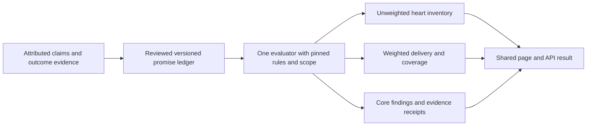

# Hearts and the verdict: methodology review

**2026-09-26. Approved for implementation by Alex.** After the review, Alex
said "Ok cool update the docs with any changes and keep working," then asked
Codex to coordinate directly with Muse through Markdown to ship the verdict
and visualization component. The implementation and release handoff lives in
[the shared contract](2026-09-26-hearts-verdict-contract.md).
This approval does not invent missing evidence or assign unreviewed weights.
It does not activate the old Index formula or any embeddings pipeline.

## Recommendation

Use the published promise record as the single scoring authority. Hearts are
its unweighted receipts; the verdict explains delivery, unresolved commitments,
and core failures from that same record. Do not feed a rendered heart count
into a second assessment system: the count has already discarded information.

Recommend coarse, explicitly justified weights per independent promise, no
negative scores, no time decay, and a core-failure finding that minor successes
cannot erase. Keep the unweighted inventory secondary. Use **Proven delivery**
for the weighted share of the whole tracked record that is demonstrably kept.
Show **Outcome coverage** with it. Keep **Kept among resolved promises** in the
breakdown; it cannot stand alone as the verdict or default ranking.

These are proposed product rules, including the weight ratios. They are not
empirically established measures of reliability, impact, or token value.

## Current baseline inspected

Local `main` at `abf6af0`, after reading the current docs and recent history:

- Active runtime methodology is promise-heart rule v3, one kept promise per
  heart. Older v0.2.0 and weighted-heart proposals are historical.
- `promise-verdict.ts` supplies unweighted kept/total and exact state counts
  from the methodology-pinned Atlas adapter. Category ranks currently use
  kept/all tracked promises in that primary category, including open records.
- `verdict.ts` separately assigns warning categories from lapsed/retired and
  core status. It has no proportional score or coverage condition. An empty
  array produces the clean category in this helper; unavailable records must
  never be passed as an empty, successfully assessed record.
- Current v3 publication rejects `active` and prohibits milestone `lapsed`.
  It has no explicit confirmed-missed milestone outcome or weight contract.
- Re-read the checked-in `hearts-promise-2026-09-26.json` artifact: 8 projects,
  115 promises, 72 fulfilled, 33 open, 5 lapsed, 5 retired. All five retired
  promises are typed milestone. None stores dedicated `claim_sources` or
  `assessed_at` fields. This is a local artifact audit, not fresh hosted-data
  or independent source verification.

The [existing editorial findings](2026-09-26-verdict-layer.md#research-sign-off-still-required)
remain open. A weighted formula cannot repair an overstated claim, a disputed
test, or a source that proves the announcement but not delivery.

## 1. Hearts feeding the verdict

The shared-ledger decision is right. The cleaner separation is **evidence and
adjudication first; deterministic projections second**. Neither the heart UI
nor an independently prompted AI gets to adjudicate the same promise again.



CODE and USAGE can support a promise's predefined test through reviewed
evidence. They do not independently boost the verdict. HYPE and market data
remain context. A future intrinsic-value or forecasting model would answer a
different question and needs its own approved specification.

## 2. Open promises and the denominator

Exclusion is honest for the question **how many resolved commitments were
kept?** It is misleading as an unqualified project score. Open is also not
synonymous with unresearched: a reviewed promise can legitimately remain open.

For one pinned project/category scope, give each admitted independent promise
a reviewed positive weight. Partition that weight into:

- `K`: kept under its original test, with sufficient evidence.
- `F`: confirmed unkept outcomes, including lapse, unmet retirement, or a
  confirmed missed delivery. Keep these reasons distinct in the record.
- `O`: pending/open, including reviewed progress without fulfillment.
- `U`: unknown, disputed assessment, or evidence too stale to support a new
  current judgment. An unresolved challenge alone does not erase a published
  finding; a reviewed revision is required.

```text
W = K + F + O + U
R = K + F

Proven delivery               = 100 * K / W       if W > 0
Outcome coverage              = 100 * R / W       if W > 0
Kept among resolved promises  = 100 * K / R       if R > 0
```

For equal weights, 2 kept and 14 open gives **12.5% proven delivery, 12.5%
outcome coverage, 100% kept among resolved**. Lead with "2 of 16 kept; 14
open," not a green 100% verdict. Research coverage and outcome coverage are
different: this example could already have all 16 claims researched.

Proven delivery is the demonstrated portion of the tracked commitment set,
not a failure rate. Open/unknown records receive no *demonstrated credit*;
they are not assigned a failed outcome. Keep their weights in the scope and
show the state split. In fraction form, proven delivery equals resolved
delivery times coverage; do not apply a second coverage penalty afterward.

Use proven delivery for the proposed category ranking. Show outcome coverage,
raw kept/total and core findings alongside it. Never rank by resolved share
alone. With no resolved outcomes, show "No resolved outcomes" and no ordinal
rank or primary performance score; the mathematical zero credited share is
not a failure verdict. An all-failed, assessed record is a real 0% result. A category with no
admitted promises is "Not applicable," not 0%. An unavailable ledger, missing
weight, or invalid denominator means the weighted result is unavailable.

This approach avoids an arbitrary minimum-coverage threshold and keeps
incomplete records visibly incomplete. It favors demonstrated completion over
unresolved ambition; it does not prove that a narrowly promising project is
more capable. Admission rules and published research scope remain necessary.

## 3. Lapsed versus retired

Distinguish the reasons, without awarding pivot points. A confirmed failed
ongoing condition and a deliberately dropped, unmet obligation both earn zero
delivery credit and remain in the denominator. A sensible business decision
can still leave an original promise unkept.

**Retired alone is insufficient to determine fulfillment.** Separate outcome
from lifecycle. A fulfilled milestone can be archived without unshipping it.
An ongoing service that stops satisfying its promised condition loses current
credit. A service explicitly promised for a finite period can complete that
obligation and later close without failing it.

| Evidence against original test | Delivery treatment | Visible explanation |
|---|---|---|
| One-time milestone demonstrably achieved, later archived | Kept, credit 1 | Delivered; later archived |
| Explicitly bounded service completed its promised period | Kept, credit 1 | Obligation completed |
| Ongoing obligation demonstrably no longer met | Unkept, credit 0 | Lapsed; reason and evidence |
| Obligation withdrawn before its test was met | Unkept, credit 0 | Retired unmet; pivot reason |
| Lifecycle says retired but fulfillment history is unclear | Unknown | Review required |

Do not automatically reclassify today's five retired milestones as successes
or failures. Review their original promises and delivery histories. Preserve
old v3 results; any changed interpretation needs a reviewed, versioned restatement.

A rename or new implementation of the same obligation stays in its lineage.
A materially different replacement is linked, while the unmet original stays
on record. A team cannot clear a failed obligation merely by calling it a pivot.

## 4. Should a broken core promise be negative?

No. Zero already lowers the weighted result through the **denominator**;
importance cannot act only in the numerator, because zero times any weight is
still zero. Negative credit introduces an additional penalty scale and remains
offsettable by enough positive commitments.

A weighted mean also cannot guarantee that the core matters most. With nine
supporting promises at weight 1 kept and a weight-4 core failed, proven delivery
is still `9 / 13 = 69.2%`. Therefore keep a separate, prominent **Core promise
unkept** finding with its exact lapse/retirement/missed reason. It must survive
all averaging and category filters; disclose if the core is outside the selected
category. Category delivery rank measures the share, not overall project safety.

A pending core reads **Core promise unresolved**. Missing core identity or
unavailable core assessment reads **Core assessment unavailable**. A kept core
does not clear other failures. No clean/healthy label follows merely from an
absence of recorded failures. When a core is kept late or an ongoing core
recovers, new evidence can change its current finding; the failure event remains.

Recommend replacing the fixed 1/4/7/10 dial with this factual headline and the
explicitly labeled delivery share, rather than inventing a conversion to ten
points. Alex approved implementing that UI and methodology direction after this review.

## 5. Weight granularity

Prefer **coarse per-promise importance**, at the independent commitment level.
Categories describe subject matter; they do not tell us whether a particular
promise is central. Category-only weights give a critical and trivial promise
in Payments equal influence and make taxonomy changes move overall scores.

Proposed global rubric for review:

| Tier | Weight | Required rationale |
|---|---|---|
| Supporting | 1 | Useful distinct commitment, not necessary to the stated central function |
| Material | 2 | Substantial user-facing capability or necessary support for that function |
| Core | 4 | The existing single core commitment that defines the project's stated function |

The 1:2:4 ratio is a simple policy choice to evaluate, not computed truth. No
arbitrary 0.73 values, per-project multiplier, zero-weight failed promise, or
post-outcome tuning. Existing core labels still need evidence review before
activation. Category ranks use these weights restricted to primary assignments;
there is no second category-weight layer or average of category averages.

Protect the unit before weighting it: one independent user-facing obligation
gets one heart slot and one weight allocation. Restatements, technical subtasks,
additional sources and incremental releases do not create extra units. If a
promise is shown as child checks, keep one scored parent and no extra hearts;
any displayed allocation among children must sum to the parent's fixed budget.
Genuinely distinct obligations require a recorded admission review. Merges or
splits cannot remove a failed obligation or its influence as a side effect.

## 6. Analyst judgment versus computed centrality

Use attributed analyst judgments with a public rationale. Ask: **if this were
never delivered, would the project still perform the function it promised?**
Assess against the original sourced function, not a conveniently edited current
marketing description. Set criteria and importance before outcome assessment
where possible; label retrospective assignments honestly.

Cosine similarity between embeddings measures semantic resemblance. It does
not establish necessity, dependency, importance, or fulfillment. A cryptographic
safety condition can be essential while phrased very differently from a
payments mission statement. My recommendation is therefore to use embeddings,
if explored later, for candidate matches, deduplication and review suggestions;
their output cannot directly move a score. [Sentence Transformers documentation](https://sbert.net/docs/sentence_transformer/usage/semantic_textual_similarity.html)
documents the semantic-similarity task, not an importance measurement.

Publish the actual author/reviewer, rationale, evidence and weight version.
Revisions show old/new inputs and the reason. Compare the proposed weights with
equal weights and a less steep 1:2:3 rubric before activation; expose unstable
comparisons rather than tuning to a preferred coin order. Equal weighting also
makes a value judgment. [JRC's weighting guide](https://knowledge4policy.ec.europa.eu/composite-indicators/toolkit_en/navigation-page/10-step-guide_en/step-6-weighting_en)
supports making these judgments explicit and transparent.

## 7. Time

Keep **no generic decay**. A milestone kept five years ago remains delivered.
An ongoing claim needs evidence covering its promised observation window today;
a five-year-old launch announcement is insufficient. Show evidence observation
dates, review dates and last meaningful delivery separately.

Specify a review cadence and evidence window when admitting an ongoing claim.
A review becoming due produces a visible stale/review-due flag, not an automatic
failure or silent score mutation. The published score remains explicitly
as-of its run. A new reviewed assessment can mark current evidence unavailable;
absence of data or a failed provider request is not evidence of non-delivery.
A known failure is not reset to unknown just because its evidence is old.

Close the **permanently open** loophole: store attributable deadlines and
success/failure conditions. A missed deadline requires reviewed evidence of
non-delivery, not just an expired date and silence. For an undated aspiration,
never invent a due date. Keep it unresolved unless evidence supports a defined
contradiction or explicit withdrawal; exclude untestable slogans from scoring.

V3 cannot express a confirmed missed milestone without pretending it lapsed or
was voluntarily retired. The proposed next contract must express that outcome.
At admission, distinguish a target date from an essential deadline condition.
A continuing delivery obligation can earn credit when delivered late, retaining
the missed-deadline event and a "Delivered late" label. If the original test
requires delivery by an essential date, later delivery cannot satisfy that
test; preserve the miss and record the later capability as context. Do not
relax that distinction after a miss or count punctuality as an extra heart.

## 8. Unweighted inventory beside the verdict

Keep the heart brand, but label the compact meter **Promises kept: 9 of 16**.
Make it secondary to the verdict and avoid "health" language. It answers how
many tracked promises are kept; the weighted share answers how much of their
reviewed importance is demonstrated. Neither number claims research is exhaustive.

Proposed card order: factual verdict/core finding; proven delivery with outcome
coverage; compact heart inventory and exact state split; evidence breakdown.
Do not show all three percentages as competing gauges. Resolved share belongs
in the breakdown. Every figure opens its exact numerator and denominator,
including excluded unresolved records for the resolved-share calculation.

Example: **Core promise lapsed. 9 of 10 promises kept. 69.2% proven delivery;
100% outcome coverage.** All nine successes are supporting weight 1; the
failed core is weight 4. The explanation makes the difference inspectable.

## 9. Gaming and edge cases

Weighting limits the influence of a *fixed* minor promise. It cannot establish
fair admission, honest evidence or completeness by itself.

| Failure mode | Required rule |
|---|---|
| Vague promises or exaggerated analyst tests | Store attributable wording, locator, issuer/community basis and a test no broader than the original claim. Untestable candidates stay visible outside scored scope. |
| Cherry-picking easy promises | Publish reviewed source scope, research cutoff, candidates and exclusion reasons; apply the same admission protocol across projects. Coverage is only of the admitted ledger. |
| Count inflation or parent/child overlap | Deduplicate by obligation, not sentence. One scored unit/budget; distinct child evidence does not multiply hearts. |
| Strategic retirement or replacement | Keep unmet obligations and their weights; link replacements and retain transitions. No deletion or zeroing of failed weight. |
| Failure parked as open | Predeclare tests/deadlines; record confirmed misses, withdrawals and contradictions. Silence alone remains unknown. |
| Difficulty or ambition disguised as importance | Weight dependence on the stated function, not how grand, costly or popular the promise sounds. |
| Category shopping | Version primary assignments and reasons; secondary tags do not affect totals. Unclassified remains visible; whole-project core findings persist in filtered views. |
| Outcome-driven reweighting or edited promises | Immutable revisions, named author/reviewer, old/new comparison; methodology changes are not performance changes. |
| Missing/stale evidence interpreted opportunistically | Separate unavailable evidence from adverse evidence; a prior confirmed failure needs affirmative correction/recovery to clear. |
| Issuer adoption claims, bots or unrelated company activity | Require the promise-specific adoption test, identify source roles and entity/asset boundaries; no generic volume or popularity bonus. |
| Rounded ranks or mixed versions | Rank on full precision with ties; display rounded values. Pin the same run, rules, admission and assignment versions across all projections. |

## 10. Structural answer and build boundary

Yes, design from the promise record. The useful third architecture is a single
ledger with **separate fulfillment, lifecycle and evidence-availability fields**,
then one deterministic evaluator returning a structured verdict. A single
number cannot preserve all three meanings. Do not add an independently scored
"AI verdict" and hope its explanation agrees with the ledger later.

The current source/test concerns are more important than fine-tuning weights.
The [OECD/JRC handbook](https://www.oecd.org/content/dam/oecd/en/publications/reports/2008/08/handbook-on-constructing-composite-indicators-methodology-and-user-guide_g1gh9301/9789264043466-en.pdf)
also recommends explicit aggregation choices and robustness checks. The core
finding and denominator rules above are our proposed choices, not prescriptions
from that source.

### Approved implementation sequence

1. **Review the admitted commitments.** Resolve the existing source/test
   findings; distinguish original claim sources from outcome evidence. Review
   retirements, overlaps, core designations and weight rationales for the eight
   projects. Keep undecided inputs unavailable, with no invented defaults.
2. **Extend the existing publication contract.** Keep stable lineage IDs and
   append-only runs. Add the necessary original-claim provenance, importance
   rationale/version, outcome/lifecycle, observation/review dates, nullable
   deadline and dated transition fields. Pin category/admission versions used
   for calculation. Align TypeScript and SQL validation; do not create another
   research database or dynamically reinterpret legacy `retired` records.
3. **Build one evaluator and calculation receipt.** Reuse the published reader,
   adapter and summary path. Return K/F/O/U weights, counts, availability/core
   findings, rule versions and contributing record IDs. Missing weights make
   that weighted scope unavailable. Preserve unknown and data-load errors.
4. **Reuse the existing card and ranking surfaces.** Replace the warning dial
   with the approved factual headline; demote/relabel the inventory; rank
   categories by proven delivery and expose coverage. Overall becomes the
   clearly labeled all-tracked view of the same calculation. No global
   intrinsic-value Index, new graph, embedding service or context-score bonus.
5. **Verify before activation.** Exercise the cases below, compare alternative
   weight rubrics on the reviewed dataset, and check mobile/desktop receipt
   navigation. Update methodology/API explanations, including current Index
   copy that proposes a separate code/usage contribution. Receipts must resolve
   the pinned run and revisions, not silently open a newer assessment.
6. **Activate a reviewed version through the existing publication path.**
   Publish a compatible reviewed run before switching active readers. Preserve
   v3 and distinguish methodology/ledger corrections from new delivery. If
   admission or outcome changes also change heart counts, version and disclose
   that restatement. Do not combine old v3 hearts with differently adjudicated
   new verdicts. Build approval does not fill in missing editorial judgments.

### Required acceptance examples

These are fictional arithmetic cases, not new project ratings.

| Case | Expected result |
|---|---|
| Equal weights: 2 kept, 14 open | Proven 12.5%; coverage 12.5%; resolved share 100%, never a clean overall verdict |
| Equal weights: all 16 open | Coverage 0%; resolved share unavailable; no ordinal rank or failure label |
| Equal weights: all 16 confirmed unkept | Proven 0%; coverage 100%; resolved share 0% |
| Nine supporting kept, weight-4 core lapsed | Proven 69.2%; coverage 100%; core finding cannot disappear |
| Same nine kept, core open | Proven 69.2%; coverage 69.2%; resolved share 100%; core unresolved |
| Same nine kept, core unknown | Same arithmetic; unavailable core evidence, not a failed core |
| Relabel lapsed as retired unmet, weights fixed | No score improvement; reason changes visibly |
| Add child checks/restatements to a kept parent | No extra hearts, weight, score or rank change |
| Kept milestone later archived | Credit retained after reviewed interpretation; history preserved |
| Ongoing claim loses current evidence versus demonstrably fails | Unknown versus lapsed are distinct; coverage falls only in the former |
| Late delivery after a target-date miss | Continuing delivery credit may recover; dated miss and lateness remain visible |
| Late delivery after an essential deadline | Original time-bound commitment remains unmet; later delivery is visible context |
| Missing assessment/weight, empty scope, or read error | Explicit unavailable/not-applicable result; no invented zero or clean verdict |
| New run arrives during a request | Inventory, verdict, categories and receipt use the same pinned run |
| Change only price, HYPE, CODE totals, or the wall clock | Published arithmetic unchanged; evidence review can produce a later run |

### Approval and coordination

Alex approved this direction and continued implementation after the review.
The original review changed documentation only. Subsequent implementation,
editorial decisions, actual verification and release status are recorded in
[the shared contract](2026-09-26-hearts-verdict-contract.md). Codex and Muse
coordinate there; neither should resurrect the provisional 0-1 weight defaults
or the resolved-only headline score from the earlier plumbing brief.
